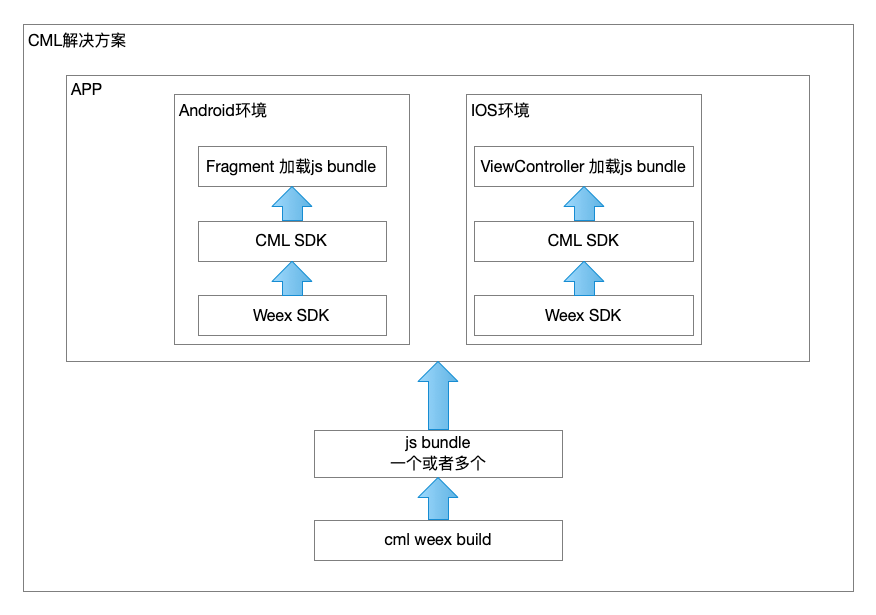
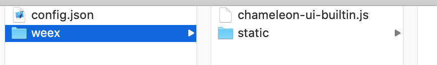
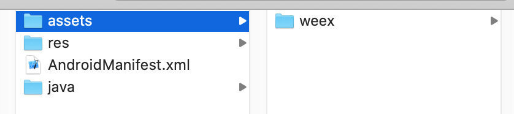

#### 先梳理下使用CML weex 产物和CML SDK以及Weex SDK之间的关系

+ cml weex build生成一个或者多个js bundle(weex渲染用的)，所以这个产物是需要放到IOS和Android工程环境中才能运行；
+ CML SDK基于Weex SDK封装了一层CML的渲染逻辑和交互协议；

#### 开始将CML工程生成的js bundle通过Android环境来运行

+ 创建Android项目 ```https://developer.android.com/training/basics/firstapp/creating-project?hl=zh-cn```

+ 引入CML SDK依赖库

   ```java
    implementation "com.didiglobal.chameleon:cmlsdk:+"
    implementation "com.didiglobal.chameleon:cmlweb:+"
    implementation "com.didiglobal.chameleon:cmlweex:+"

    implementation 'com.google.code.gson:gson:2.8.5'
    implementation 'com.alibaba:fastjson:1.2.54'
    implementation 'com.squareup.okhttp3:okhttp:3.11.0'

    debugImplementation 'com.didichuxing.doraemonkit:doraemonkit-weex:+'
    releaseImplementation 'com.didichuxing.doraemonkit:doraemonkit-weex-no-op:+'
   ```

+ 创建一个Application类，实现`ICmlConfig`接口方法,完成SDK初始化;
+ 在MainActivity中使用CmlWeexView进行渲染js bundle;
```java
  private CmlWeexView cmlView;
  
  	// 可以是服务器下载地址，也可以是assets下的文件路径

    // 加载远程的JS Bundle文件
    // private String IP = "192.168.4.223:5556";
    // private String RENDER_URL = "http://" + IP + "/?cml_addr=http://"+IP+"/weex/chameleon-ui-builtin.js&path=/pages/index/index";
		
		// 加载Assets目录的js bundle
    private String RENDER_URL = "file://local/weex/chameleon-ui-builtin.js";

  @Override
  protected void onCreate(@Nullable Bundle savedInstanceState) {
    super.onCreate(savedInstanceState);
    setContentView(R.layout.activity_main);

    FrameLayout flRoot = findViewById(R.id.fl_root);
    cmlView = new CmlWeexView(this);
    flRoot.addView(cmlView, new FrameLayout.LayoutParams(ViewGroup.LayoutParams.MATCH_PARENT, ViewGroup.LayoutParams.MATCH_PARENT));
    cmlView.onCreate();
    cmlView.render(RENDER_URL, null);
  }
```

+ 更多SDK功能说明请看官网介绍：```https://cml.js.org/tutorial/android-sdk.html```

#### 示例：

+ 将chameleon-ui-builtin代码进行build后得到产物

  

+ 将上述产物放置Android工程assets下

  

运行Android工程后的效果

